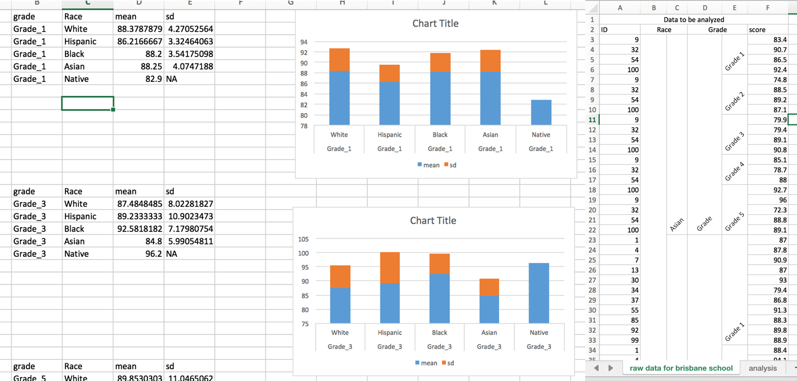
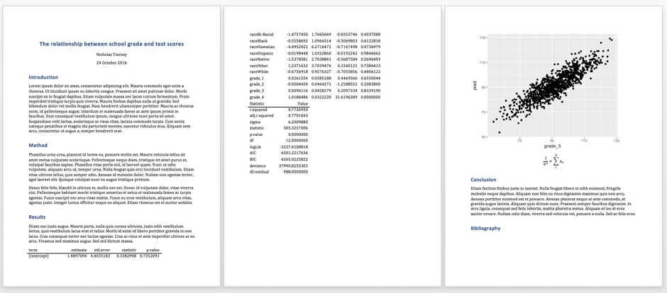
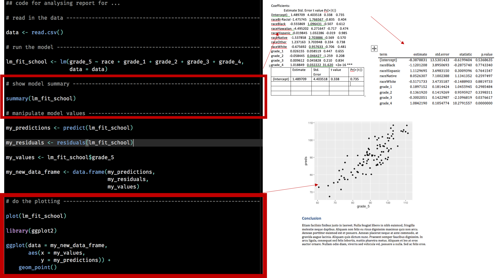
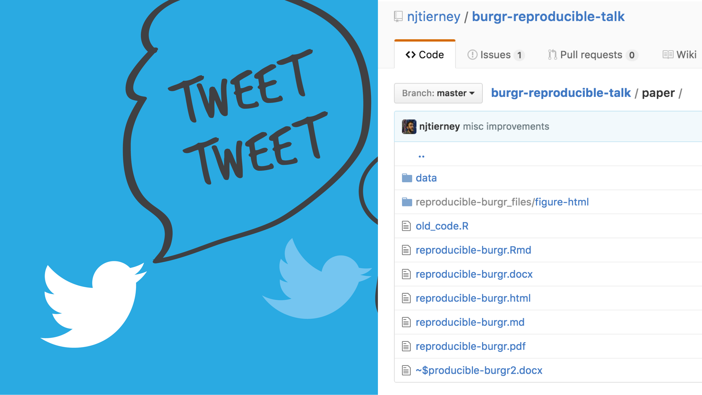

    
## The Situation {data-background=#FF9900}

<!-- OK, let's talk about writing a paper. -->

<!-- You've just finished writing a paper. -->

<!-- You are ready to send it to your collaborators for their perusal. -->

<!-- The paper is about modelling student results in one school in Australia. -->

<!-- It's been a long process.  -->

<!-- You've been writing your analysis in this thing called "R".  -->

<!-- Let's recap some of the tricky parts. -->

## The Data {data-background=#6599FF}

## {data-background=#6599FF}

Despite "helpful pre-aggregation", you managed to <strike>put out the fire</strike> unaggregate it.

There only about 500 observations

You didn't feel too bad about combing through 500 rows.

You'd only need to do it once

... right?

## The paper {data-background=#6599FF}

You wrote your document in Word

That's what your other collaborator used.

## The analysis {data-background=#6599FF}

<!-- You're really happy, you've written all your code in 1 R script that: -->

<!-- Builds a linear model -->

<!-- Prints out the summary  -->

<!-- _which you copy and paste into word_ -->

<!-- Creates a bunch of plots that you used to look at your model  -->

<!-- _which you manually saved and inserted into word_ -->

## Submit and celebrate {data-background=#6599FF}

It's a short, well written paper.

You are really happy with it.

You email it to your collaborators

You get a burger to celebrate.

image from http://aht.seriouseats.com/images/2013/09/20130917-266522-one-eared-stag-meatstick.jpg

## Notification {data-background=#4CD964}

Collaborator:

> Wow, great job!

> I've just managed to get ethical approval to host the data online, and we also have another 10 schools to add ...

> so we've got another 1000 data points! 

> Do you think you could just redo the plots and the tables and see if anything changes?

## ... That's ... annoying {data-background=#c92828}

## You start to imagine ... {data-background=#6599FF}

All of the code

Building the models again

Copying the tables into word

Inserting the figures

<!-- and you start to feel cracks appear, you feel so damn tired, you start to wonder if - -->

## Notification {data-background=#4CD964}

> Sorry, forgot to attach the data. 

> It's in the same format as last time, that is fine, right? 

> Didn't seem to cause you a problem last time! :)

## Blinding Rage {data-background=#e31616}

You lose your mind and go into a murderous rage, letting loose on the students in the university armed with nothing but a steak knife.

<!-- Alongside the phrase *going postal*, they now add the phrase *it's reproducible*. -->

## Wait, What?

So let's pause for a minute before I take this story further.

It's 2016.

## {data-background-image="https://upload.wikimedia.org/wikipedia/commons/8/89/STS-116_spacewalk_1.jpg"}

## {data-background-image="http://specials-images.forbesimg.com/imageserve/38606109/960x0.jpg?fit=scale"}

## {data-background-image="https://cdn1.vox-cdn.com/thumbor/SgIWbmtZPdngX0pP4ObeJ2h1_uA=/cdn0.vox-cdn.com/uploads/chorus_asset/file/6765535/Abra%20toilet.jpg"}

## {data-background-image="https://67.media.tumblr.com/e3e059dec30337f593abc3b554162eb9/tumblr_nb4z62cjaL1ry46hlo1_500.gif"}

# Is there a better way?

## 

The answer is yes.

The answer, is **rmarkdown**.

## Go back in time

Set the wayback machine for 3 months ago.

{  demo  }

# Pause

Here's what happens.

You take your R code.

You put it into chunks.

You have your step that reads in your data.

It cleans it.

At first it hurts, and then it becomes addictive and interesting. Like pistachios, but it's data science. Data nuts. Nut science? You're not sure what to call it, but you like it.

You've written your introduction, you're really clear on what your paper is going to achieve.

You run your model again - you have the output, and then you run some code that makes the table for you.

You have some code that creates the plots.

You've got all these chunks, they all do different things.

And then make like Sauran, and bind them together for a single united purpose.

It's your paper. It's knitted together. The table is there. The figures are where you want them.

It's one document of code.

It's in HTML.

It's in PDF.

And:

It's in word.

## Way Back, rewind.

OK. So you're back in the cafeteria, holding a steak knife

Your collaborator adds another 1000 rows to your dataset.

You don't go into a murderous rage.

You take 10 minutes. You eyeball the data. Check it reads in OK.

You knit the document together.

You get changes in the tables and plots.

It's all in one document. It's rmarkdown. It's great. You send the paper through to your collaborator. You go to eat another burger but it's only been 1 hour so you just make a cup of tea instead.

# Submit and Publish {data-background-image="images/save-submit.png"}

Fast track 3 months - your paper has gone through a fast review process, the reviewers were all able to recreate your results, they're impressed.

## Share and Promote

You put all the code and data onto this thing called GitHub, where people can access it. You post about your accomplishment on twitter, and then you forget about it.

## Enter <Insert Academic> {data-background=#6599FF}

Someone reads your paper. 

They like what they see. 

They get the code and the data from github

They reproduce your results.

Then they add a bit more - they try out this new statistical model on your data.

## Reproduction, Publication. {data-background=#FF9900}

They get some extra insights.

Glean some new information.

They publish a paper based on your research.

## Publication, Celebration {data-background=#6599FF}

You get cited.

You celebrate, you eat a burger.

This whole process, it is reproducible - you can do it too.

## It's free. {data-background=#FF9900}

Also, it's free. I think I forgot to mention that.

## References

- kids study: http://media2.s-nbcnews.com/j/newscms/2014_12/258671/140317-kids-school-test-525_5838cb89d4483cd7f8cfbfe5210493e9.nbcnews-ux-2880-1000.jpg

- dumb and dumber gif: https://media.giphy.com/media/ToMjGpKniGqRNLGBrhu/giphy.gif

- burger image: http://aht.seriouseats.com/images/2013/09/20130917-266522-one-eared-stag-meatstick.jpg

- knife attack: http://media.graytvinc.com/images/810*455/japan+knife+attack.jpg

- space station: https://upload.wikimedia.org/wikipedia/commons/8/89/STS-116_spacewalk_1.jpg

- smartphone: http://specials-images.forbesimg.com/imageserve/38606109/960x0.jpg?fit=scale

- pokemon toilet: https://cdn1.vox-cdn.com/thumbor/SgIWbmtZPdngX0pP4ObeJ2h1_uA=/cdn0.vox-cdn.com/uploads/chorus_asset/file/6765535/Abra%20toilet.jpg

- lightsaber cats: https://67.media.tumblr.com/e3e059dec30337f593abc3b554162eb9/tumblr_nb4z62cjaL1ry46hlo1_500.gif

- computer kid: https://media.giphy.com/media/XreQmk7ETCak0/giphy.gif

- Spongbob gif: https://media.giphy.com/media/MTclfCr4tVgis/giphy.gif