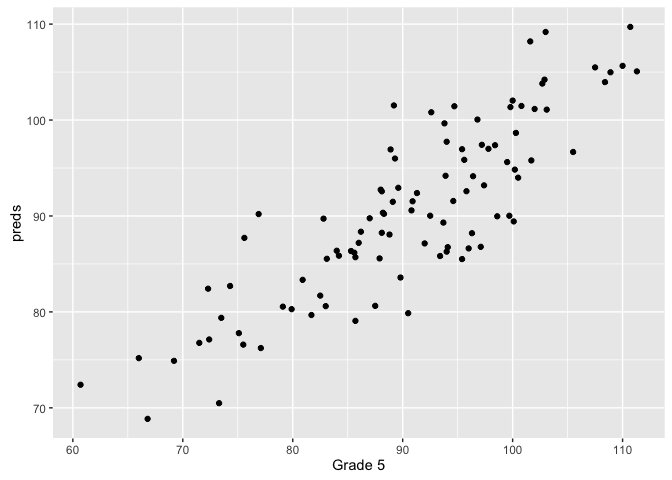

# The Importance of Reproducible Burgers
Nicholas Tierney  
17 August 2016  

# Introduction

Lorem ipsum dolor sit amet, consectetur adipiscing elit. Mauris commodo eget enim a rhoncus. Ut tincidunt ipsum eu lobortis congue. Praesent sit amet pulvinar dolor. Morbi suscipit ex in feugiat dapibus. Etiam vulputate massa nec lacus rutrum fermentum. Proin imperdiet tristique turpis quis viverra. Mauris finibus dapibus nulla ut gravida. Sed bibendum dolor vel mollis feugiat. Nam hendrerit ullamcorper porttitor. Mauris ac rhoncus enim, id pellentesque augue. Interdum et malesuada fames ac ante ipsum primis in faucibus. Duis consequat vestibulum ipsum, congue ultricies nunc porta sit amet. Suspendisse velit lectus, scelerisque ac risus vitae, lacinia commodo turpis. Cum sociis natoque penatibus et magnis dis parturient montes, nascetur ridiculus mus. Aliquam sem arcu, consectetur at augue a, semper hendrerit erat.

# Method

Phasellus urna urna, placerat id lorem eu, posuere mollis est. Mauris vehicula tellus sit amet metus vulputate scelerisque. Pellentesque neque diam, tristique sit amet purus et, volutpat faucibus sapien. Phasellus vitae porta nisl, id laoreet quam. Nunc ut odio vulputate, aliquam arcu ut, tempor urna. Nulla feugiat quis orci tincidunt vestibulum. Etiam vitae ultrices tellus, quis semper odio. Aenean id molestie dolor. Nullam non egestas tortor, eget laoreet elit. Quisque volutpat nunc eu augue tristique pretium.

Donec felis felis, blandit in ultrices et, mollis nec est. Donec id vulputate dolor, vitae viverra nisi. Pellentesque habitant morbi tristique senectus et netus et malesuada fames ac turpis egestas. Fusce suscipit nec arcu vitae mattis. Fusce eu eros vestibulum, aliquam arcu vitae, egestas justo. Integer luctus efficitur neque eu aliquet. Etiam rhoncus est et auctor sodales.

# Results

Etiam nec justo augue. Mauris porta, nulla quis cursus ultricies, justo nibh vestibulum lectus, quis vestibulum lacus erat et tellus. Morbi id enim id libero porttitor gravida in non lacus. Cras consequat tortor nec luctus egestas. Cras ac risus et ante imperdiet ultrices ac eu arcu. Vivamus sed maximus augue. Sed sed dictum massa.

term              estimate    std.error    statistic     p.value
-------------  -----------  -----------  -----------  ----------
(Intercept)     -8.7949414   13.4381308   -0.6544765   0.5144926
raceBlack       -0.7512246    3.8755299   -0.1938379   0.8467445
raceHispanic     1.5893486    3.6859881    0.4311866   0.6673753
raceNative      10.0365101    7.1722450    1.3993540   0.1651826
raceWhite        0.1630490    3.4785775    0.0468723   0.9627200
ID              -0.0318781    0.0211418   -1.5078256   0.1351408
`Grade 1`        0.2167060    0.1810592    1.1968794   0.2345320
`Grade 2`        0.1254113    0.1411145    0.8887201   0.3765492
`Grade 3`       -0.2966817    0.1413218   -2.0993339   0.0386188
`Grade 4`        1.0804967    0.1047681   10.3132241   0.0000000

Statistic               Value
--------------  -------------
r.squared           0.7329639
adj.r.squared       0.7059603
sigma               5.8115676
statistic          27.1431458
p.value             0.0000000
df                 10.0000000
logLik           -309.4291668
AIC               640.8583335
BIC               669.4046519
deviance         3005.9143040
df.residual        89.0000000

<!-- -->

# Conclusion

Etiam facilisis finibus justo in laoreet. Nulla feugiat libero in nibh euismod, fringilla molestie neque dapibus. Aliquam non felis eu risus dignissim maximus quis non arcu. Aenean porttitor euismod est et posuere. Aenean placerat neque at ante commodo, at gravida augue lacinia. Aliquam quis dictum nunc. Praesent semper faucibus dignissim. In arcu ligula, consequat sed felis lobortis, mattis pharetra metus. Aliquam et leo at eros auctor ornare. Nullam odio diam, viverra sed vehicula vel, posuere a nulla. Sed ac felis eros.

# Bibliography
